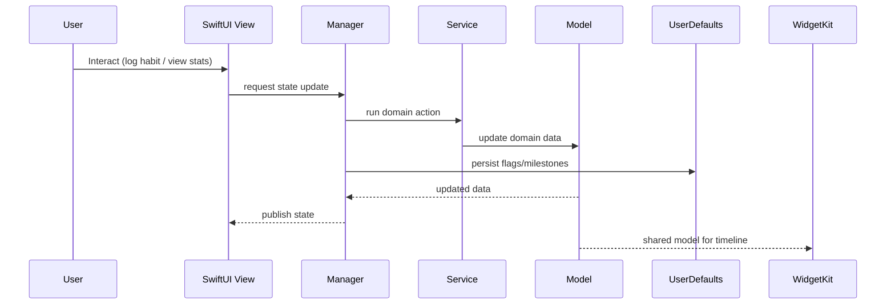

# Architecture — Yearlit

## Overview
Yearlit is a SwiftUI iOS app focused on year‑level tracking and habit/streak visualization. The repo contains the main iOS app target plus multiple WidgetKit extensions (Habits, Streak, Year) that surface data on the Home Screen. Shared models live in `SharedModels/` and are used across the app and widgets.

## High‑level structure
- **App target**: `My Year/`
  - **Views**: `Views/` (feature UI), `Components/` (reusable UI), `Modifiers/`
  - **Domain models**: `Models/` and `SharedModels/`
  - **Managers**: `Managers/` (state + orchestration)
  - **Services**: `Services/` (entry creation and feature workflows)
  - **Utilities**: `Utils/` (date, stats, streaks, feedback, HTTP helpers)
  - **Config/`** and `WhatsNew/` (feature gating and release notes)
- **Widgets**: `HabitsWidget/`, `StreakWidget/`, `YearWidget/`
- **Tests**: `My YearTests/`, `My YearUITests/`

## Core runtime flow
1. **User interactions** occur inside SwiftUI `Views` and `Components`.
2. Views call into **Managers** and **Services** for state changes and business rules.
3. Domain data is represented by **Models** (app‑local) and **SharedModels** (app + widgets).
4. Lightweight persistence and feature tracking use **UserDefaults** (e.g., milestones, whats‑new state).
5. Widget targets read shared model/state to render timeline entries in WidgetKit.

## Data & state
- **Persistence**: UserDefaults for local state (milestones, feature‑prompt/whats‑new).
- **Shared models**: used by app + widgets for timeline data.
- **Stats & streaks**: calculated via `Utils/Stats`, `Utils/Streaks` helpers.

## Widgets
Each widget target has its own entry provider and view composition, but shares the domain models:
- Habits widget: `HabitsWidget/`
- Streak widget: `StreakWidget/`
- Year widget: `YearWidget/`

## Mermaid — component view
```mermaid
flowchart TB
  subgraph App[Yearlit App (SwiftUI)]
    Views[Views/]
    Components[Components/]
    Managers[Managers/]
    Services[Services/]
    Models[Models/]
    Utils[Utils/]
    Config[Config/ & WhatsNew/]
  end

  subgraph Shared[SharedModels]
    SharedModels[SharedModels/]
  end

  subgraph Widgets[WidgetKit Extensions]
    Habits[HabitsWidget]
    Streak[StreakWidget]
    Year[YearWidget]
  end

  Views --> Managers
  Views --> Services
  Components --> Managers
  Managers --> Models
  Services --> Models
  Managers --> Utils
  Services --> Utils
  Models --> SharedModels
  Habits --> SharedModels
  Streak --> SharedModels
  Year --> SharedModels
  Managers --> Config
```

## Mermaid — interaction flow


## Key modules (by folder)
- `Views/` — feature UI: onboarding, calendars, entries, settings, share.
- `Managers/` — orchestration for streak tracking, feature prompts, and app‑level state.
- `Services/` — entry creation and business actions.
- `Utils/` — date helpers, streak math, stats, HTTP helpers, feedback/paywall flows.
- `SharedModels/` — cross‑target data models for app + widgets.

## Extension points / future growth
- Add persistent storage (SwiftData/CoreData) if entries grow beyond lightweight usage.
- Consider an explicit data layer for widget timelines if offline caching is needed.
- Add modular feature packages under `Views/` + `Managers/` for new tracking types.

## Build & entrypoints
- Xcode project: `My Year.xcodeproj`
- Main app target: `My Year/`
- Widget targets: `HabitsWidget`, `StreakWidget`, `YearWidget`
