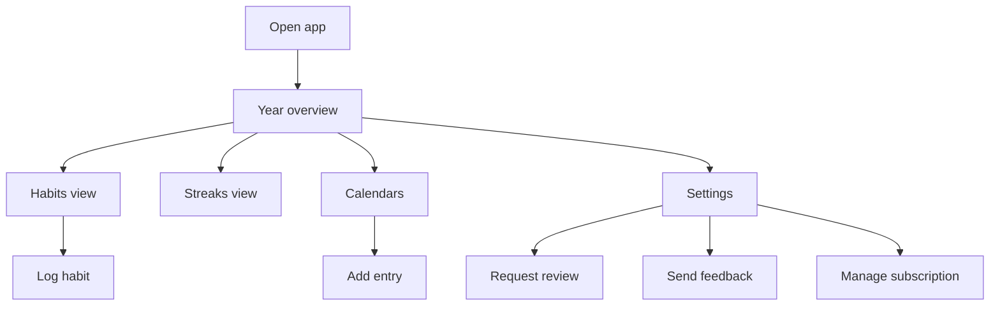
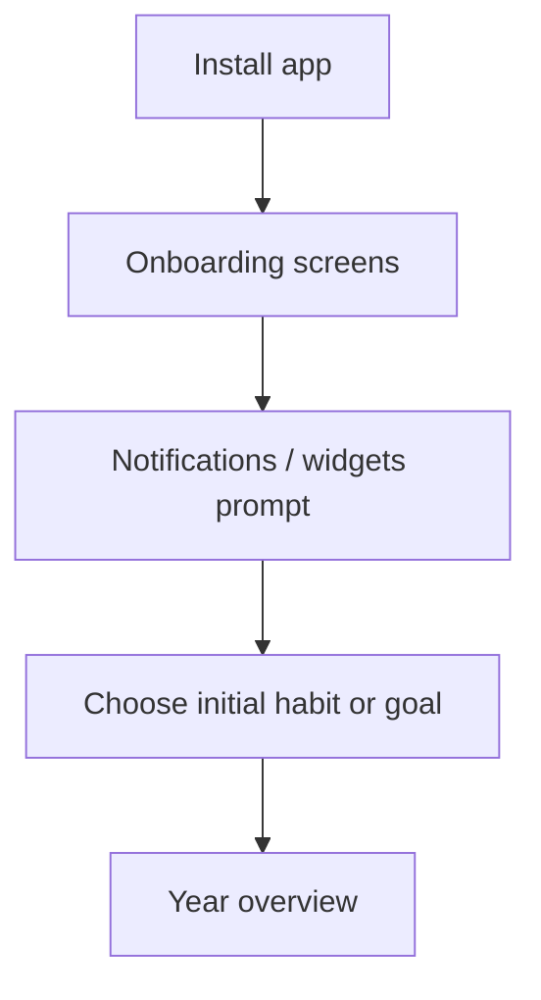
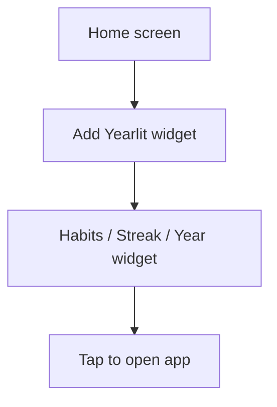

# User Flow — Yearlit

## Core flow: daily usage

```mermaid
flowchart TD
  Start[Open app] --> Home[Year overview]
  Home --> Habits[Habits view]
  Habits --> LogHabit[Log habit]
  Home --> Streaks[Streaks view]
  Home --> Calendars[Calendars]
  Calendars --> Entry[Add entry]
  Home --> Settings[Settings]
  Settings --> Reviews[Request review]
  Settings --> Feedback[Send feedback]
  Settings --> Paywall[Manage subscription]
```

## Onboarding

```mermaid
flowchart TD
  Install[Install app] --> Onboarding[Onboarding screens]
  Onboarding --> Permissions[Notifications / widgets prompt]
  Permissions --> Setup[Choose initial habit or goal]
  Setup --> Home[Year overview]
```

## Widget usage

```mermaid
flowchart TD
  HomeScreen[Home screen] --> AddWidget[Add Yearlit widget]
  AddWidget --> WidgetView[Habits / Streak / Year widget]
  WidgetView --> OpenApp[Tap to open app]
```
